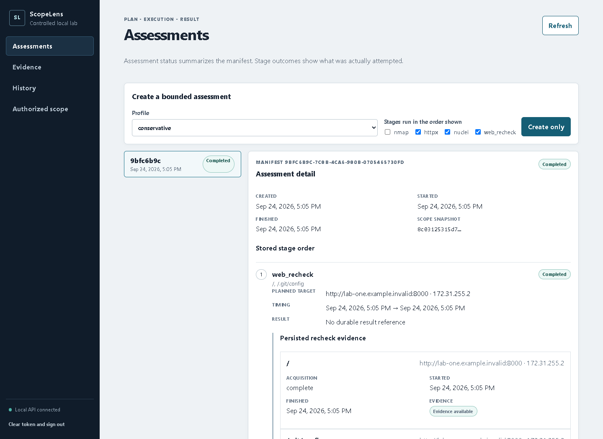
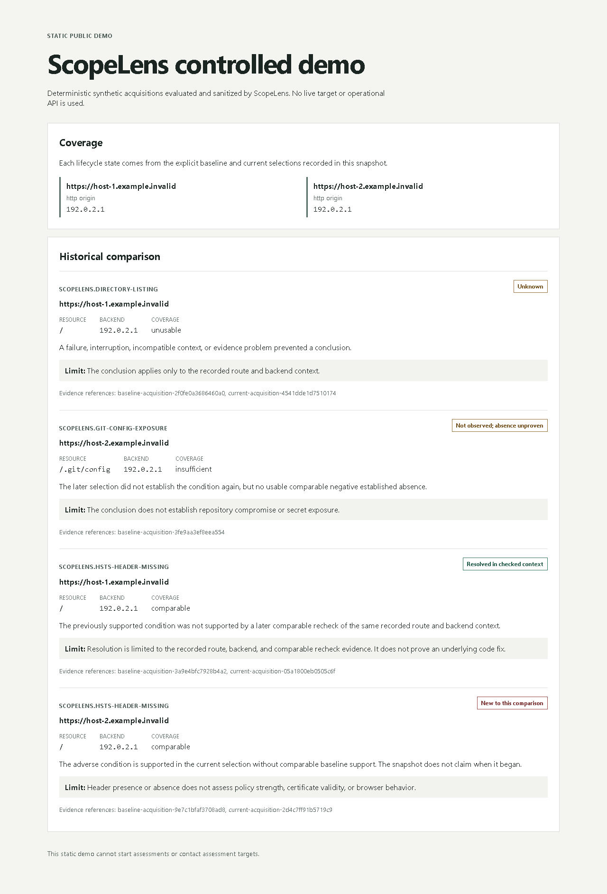

<p align="center">
  
</p>

<h1 align="center">ScopeLens</h1>

<p align="center"><strong>Evidence-led assessment and reassessment for explicitly authorized services.</strong></p>

<p align="center">
  <a href="https://github.com/Affaniqbal234/ScopeLens/actions/workflows/ci.yml"></a>
  <a href="LICENSE"></a>
  
  
  
</p>

ScopeLens is a local platform for evidence-led assessment and reassessment of
services you are explicitly authorized to test. It runs bounded Nmap,
ProjectDiscovery httpx, and restricted Nuclei checks, stores their machine-readable
evidence, correlates observations without discarding provenance, and uses focused
deterministic rechecks to establish what the evidence can support.

The product is built around a practical question: after a service changes, which
previously supported conditions are absent under a comparable recheck, which were
merely not seen again, and which remain unknown because coverage or evidence was
insufficient?



_The authenticated operational dashboard showing a completed assessment against
the bundled controlled lab. The view exposes the immutable plan, exact authorized
origin and address, stage outcome, and persisted evidence health without including
the API token or raw artifact content._

## What ScopeLens does

| Area | Behavior |
| --- | --- |
| Bounded collection | Runs conservative Nmap and httpx profiles plus reviewed Nuclei templates without arbitrary flags, templates, commands, or target expansion. |
| Evidence preservation | Stores scanner runs, normalized observations, provenance, digests, acquisition context, and private raw artifacts. |
| Correlation | Keeps hosts, network services, HTTP origins, resources, scanner assertions, and their relationships distinct. Shared IP addresses do not merge virtual hosts. |
| Deterministic assessment | Evaluates narrow directory-listing, exposed Git configuration, and missing-HSTS claims. Scanner severity stays separate from assessment certainty. |
| Focused retesting | Rechecks only approved origins, addresses, and fixed resources. Timeouts, blocked responses, malformed evidence, and skipped checks remain inconclusive. |
| Historical comparison | Compares explicit baseline and current inputs with claim-specific coverage, backend context, evidence health, rule compatibility, and acquisition ordering. |
| Local operation | Persists immutable assessment plans and stage outcomes through a single durable worker, authenticated local API, React dashboard, reports, and recovery workflow. |

## Evidence-led workflow

1. Define exact network targets, ports, web origins, and approved destination
   addresses in server-owned configuration.
2. Create an immutable assessment plan with an explicit ordered stage list.
3. Execute the plan through the bounded single worker. Planned, running, completed,
   skipped, failed, and interrupted stages remain distinguishable.
4. Inspect normalized inventory, scanner assertions, evidence health, deterministic
   assessment outcomes, and limitations.
5. After changing the controlled service, create a focused recheck for an already
   authorized claim and context.
6. Compare explicitly selected baseline and current evidence. ScopeLens never
   silently chooses the latest run or treats a missing scanner match as proof of
   absence.

### Historical states

ScopeLens reports `new`, `unchanged`, `resolved`, `not_observed`, and `unknown`.
The three states most likely to be confused have deliberately narrow meanings:

| State | Meaning |
| --- | --- |
| `resolved` | A previously supported adverse condition received a later, healthy, compatible `supported_negative` result for the same rule, origin, resource, and backend context. It means only that the condition was not supported by that comparable recheck. It does not prove a code fix or safety elsewhere. |
| `not_observed` | The selected later evidence did not establish the condition again, but no usable comparable negative proved its absence. Omitted checks, narrower coverage, and empty scanner output belong here when their evidence is otherwise usable. |
| `unknown` | A failure, interruption, incompatible rule or context, missing or corrupt evidence, or another coverage problem prevents a responsible conclusion. It never means safe. |

Assessment outcomes are similarly evidence-specific. `supported_positive` supports
the stated adverse claim, `supported_negative` establishes only the narrow absence
defined by that rule, and `inconclusive` means the available evidence cannot answer
the claim.

## Run the local application

Run these commands from the repository root. The supported V1 deployment requires
Git and either Docker Desktop with WSL2 and Linux containers or Docker Engine with
Compose. It starts PostgreSQL, the loopback-bound authenticated API, the dashboard,
private artifact storage, and the isolated controlled lab.

```powershell
Copy-Item .env.example .env
# Set SCOPELENS_POSTGRES_PASSWORD and a 32-character or longer SCOPELENS_API_TOKEN.
docker compose config --quiet
docker compose build
docker compose up -d --wait
```

Open `http://127.0.0.1:8080` and enter the API token from `.env`. The dashboard
keeps the token in memory for the current tab. The bundled configuration authorizes
only the controlled Docker lab.

For a first assessment:

1. Open **Authorized scope** and review the configured lab origins, address, ports,
   and conservative profile.
2. Return to **Assessments**, choose the permitted stages, and select **Create only**.
3. Inspect the stored stage order and planned targets before selecting
   **Run pending assessment**.
4. Review each stage outcome and its evidence or limitations. Creating an
   assessment does not execute it, and a restart does not run pending work or retry
   interrupted work.

Use the [local operations and recovery guide](docs/operations.md) for the complete
vulnerable-to-fixed lab workflow, interruption handling, and paired PostgreSQL and
artifact backup/restore procedure.

## Static public demo

The public demo is a separate static build. Its committed snapshot comes from
deterministic synthetic acquisition fixtures evaluated through the real assessment
and historical comparison logic, then reduced by the `public-snapshot-v1`
allowlist. It is not an authentic capture from the integrated V1 lab assessment.



_A genuine capture of the static public demo. Its displayed data is synthetic and
sanitized; it is separate from the authenticated operational dashboard shown
above._

The demo has no operational API client, API token, database, worker action, scanner
binary, private artifact volume, or scanning control.

```powershell
cd frontend
npm ci
npm run build:demo
npm run verify:demo
cd ..
docker compose -f deploy/compose.demo.yaml up -d --build --wait
```

Open `http://127.0.0.1:8081/demo.html`. This repository does not deploy the demo or
provide a hosted URL.

## Architecture

```text
authorized configuration
        |
durable assessment manifest and single worker
        |
bounded scanner/recheck execution
        |
private artifacts + normalized PostgreSQL history
        |
correlation -> deterministic assessment -> historical comparison
        |
local API -> dashboard / JSON and HTML reports / sanitized snapshot
```

Scanner-specific execution and parsing stay separate from normalized domain data.
Correlation is an on-demand deterministic projection over selected history.
Assessment results do not mutate captured scanner evidence, and historical
comparison does not reinterpret scanner output as a negative check.

The main implementation boundaries are:

- `src/scopelens/adapters` and `src/scopelens/execution`: scanner parsing and
  bounded processes
- `src/scopelens/domain`, `analysis`, `assessment`, and `comparison`: normalized
  identities and deterministic reasoning
- `src/scopelens/storage` and `orchestration`: PostgreSQL history, private
  artifacts, manifests, stage attempts, and restart behavior
- `src/scopelens/api`, `frontend`, and `src/scopelens/reporting`: the local
  interface and faithful presentation of existing semantics

## Authorization and safety boundaries

- Network authorization covers exact IPv4 addresses and explicit TCP ports. Web
  authorization covers an exact origin and approved destination addresses. One
  never grants the other.
- DNS answers, redirects, reported peers, scanner findings, and prior history never
  expand the assessment plan.
- The API accepts server-configured projects, profiles, stages, and focused recheck
  contexts. It does not accept arbitrary scanner flags, templates, executables,
  HTTP methods, resources, or filesystem paths.
- The operational API and dashboard bind to host loopback by default. The static
  public demo is structurally separate and cannot submit assessments or rechecks.
- Raw evidence can contain sensitive headers or response data. ScopeLens keeps it
  in private artifact storage and exposes bounded metadata through the API.

A valid configuration records the operator's declared scope. It does not prove
ownership or permission. Use ScopeLens only against localhost, the bundled lab, or
systems you own or have explicit permission to assess.

## Current V1 limits

- Scope targets are IPv4-based; IPv6 and CIDR expansion are not supported.
- The worker is intentionally single-process, with no scheduling, automatic retry,
  or distributed queue.
- Nuclei execution is restricted to two reviewed read-only templates. Focused web
  rechecks cover those exposure conditions plus the narrow missing-HSTS claim.
- Empty scanner output is never treated as supported negative evidence.
- ScopeLens has one local API token and no multi-user or internet-facing tenancy.
- PostgreSQL metadata and private artifacts form one recovery set and must be
  backed up together.

## CLI, reports, and development

The [CLI and technical reference](docs/cli-reference.md) documents configuration,
offline imports, live scanner commands, persistence, correlation, assessment,
comparison, durable manifests, reports, and opt-in integration suites.

For a local Python development environment:

```sh
uv sync --locked
uv run --locked scopelens --help
uv run --locked pytest
uv run --locked ruff check .
uv run --locked ruff format --check .
uv run --locked mypy
```

For the frontend:

```sh
cd frontend
npm ci
npm test
npm run typecheck
npm run build
```

The stack uses Python 3.14, FastAPI, SQLAlchemy and Alembic, PostgreSQL, React,
TypeScript, Vite, Docker Compose, pytest, and Vitest. FastAPI exposes local OpenAPI
documentation at `/docs` while the operational API is running.

## License

ScopeLens source code is licensed under the [MIT License](LICENSE). External
scanner tools and future redistributed dependencies retain their own licenses.
